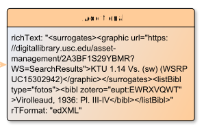

# Additional

**Additional** represents additional resources for an EditionObject.

**Name**: Additional

**Type**: Node

**Subclass of**: [Metadata](../../../Abstract%20Model/Nodes/Metadata.md)

## Properties

* *@content*
  * **name**: [content](../Properties/properties.md#content)
  * **datatype**: string
  * **status**: required
* *@mimeType*
  * **name**: [mimeType](../Properties/properties.md#mimeType)
  * **datatype**: string
  * **status**: required

## Domain of Relations

None

## Range of Relations

* [hasAdditional](../Relations/hasAdditional.md) (from [SourceDesc](SourceDesc.md))

## Examples

