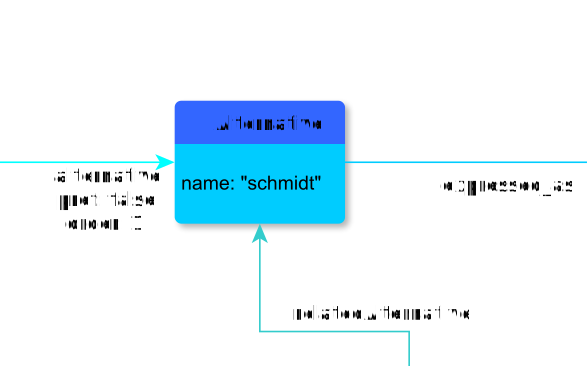

# Alternative

**Alternative** represents an interpretation

**Name**: Alternative

**Type**: Node

**Subclass of**: [Alternative](../../../Abstract%20Model/Nodes/Alternative.md)

## Properties

* *@name*
  * **name**: [name](../Properties/properties.md#name)
  * **datatype**: string
  * **status**: required

## Domain of Relations

* [expressedAs](../Relations/expressedAs.md) (to [TextUnit](../../../Abstract%20Model/Nodes/TextUnit.md))
* [relatedAlternative](../Relations/relatedAlternative.md) (to itself)

## Range of Relations

* [alternative](../Relations/alternative.md) (from [Alternatives](Alternatives.md))
* [annotates](../Relations/annotates.md) (from [Annotation](Annotation.md))
* [mentions](../Relations/mentions.md) (from [Annotation](Annotation.md))
* [relatedAlternative](../Relations/relatedAlternative.md) (from itself)

## Examples

