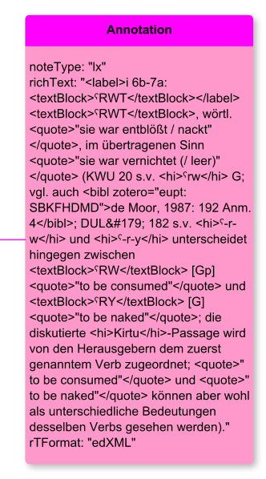

# Annotation

**Annotation** represents an annotation to anything

**Name**: Annotation

**Type**: Node

**Subclass of**: [Annotation](../../../Abstract%20Model/Nodes/Annotation.md)

## Properties

* *@ref*
  * **name**: [ref](../Properties/properties.md#ref)
  * **datatype**: URI
  * **status**: optional
* *@content*
  * **name**: [content](../Properties/properties.md#content)
  * **datatype**: string
  * **status**: required
* *@mimeType*
  * **name**: [mimeType](../Properties/properties.md#mimeType)
  * **datatype**: string
  * **status**: required
* *@type*
  * **name**: [type](../Properties/properties.md#type)
  * **datatype**: string
  * **status**: required

## Domain of Relations

* [annotates](../Relations/annotates.md) (to [Thing](../../../Abstract%20Model/Nodes/Thing.md))
* [mentions](../Relations/mentions.md) (to [Thing](../../../Abstract%20Model/Nodes/Thing.md))

## Range of Relations

* [annotates](../Relations/annotates.md) (from itself)
* [mentions](../Relations/mentions.md) (from itself)

## Examples

