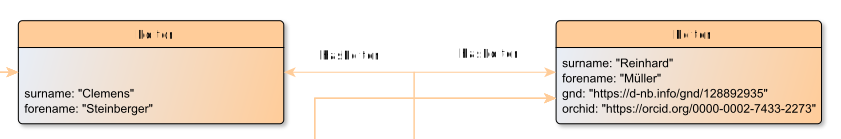

# Change

**Change** documents a change or set of changes made during the production of a graph database, or during the revision of a graph database.

**Name**: Change

**Type**: Node

**Subclass of**: [Metadata](../../../Abstract%20Model/Nodes/Metadata.md)

## Properties

* *@desc*
  * **name**: [desc](../Properties/properties.md#desc)
  * **datatype**: string
  * **status**: required

* *@status*
  * **name**: [status](../Properties/properties.md#status)
  * **datatype**: string
  * **values**: ('draft', 'final')
  * **status**: required

* *@when*
  * **name**: [when](../Properties/properties.md#when)
  * **datatype**: xsd:data (YYYY-MM-DD)
  * **status**: required

## Domain of Relations

* [coEditedBy](../Relations/coEditedBy.md) (to [Editor](ChaEditornge.md))
* [editedBy](../Relations/editedBy.md) (to [Editor](Editor.md))

## Range of Relations

* [hasChange](../Relations/hasChange.md) (from [RevisionDesc](RevisionDesc.md)

## Examples

