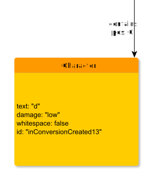

# Character

**Character** represents a single character.

**Name**: Character

**Type**: Node

**Subclass of**: [Character](../../../Abstract%20Model/Nodes/Character.md)

## Properties

* *@damage*
  * **name**: [damage](../Properties/properties.md#damage)
  * **datatype**: string
  * **values**: ('high', 'low')
  * **status**: optional

* *@id*
  * **name**: [id](../Properties/properties.md#id)
  * **datatype**: string
  * **status**: optional

* *@text*
  * **name**: [text](../Properties/properties.md#text)
  * **datatype**: string
  * **status**: required

* *@unclear*
  * **name**: [unclear](../Properties/properties.md#unclear)
  * **datatype**: boolean
  * **status**: optional

* *@whitespace*
  * **name**: [whitespace](../Properties/properties.md#whitespace)
  * **datatype**: string
  * **status**: required

## Domain of Relations

None

## Range of Relations

* [annotates](../Relations/annotates.md) (from [Annotation](Annotation.md))
* [expressedAs](../Relations/expressedAs.md) (from [Alternative](Alternative.md))
* [mentions](../Relations/mentions.md) (from [Annotation](Annotation.md))
* [contains](../Relations/contains.md) (from [Word](Word.md))

## Examples

