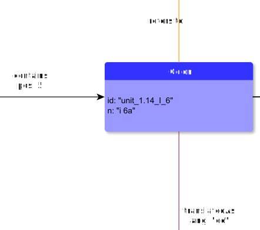

# Colon

**Colon** represents a Colon in Ugaritic poetology.

**Name**: Colon

**Type**: Node

**Subclass of**: [PoetologicalUnit](PoetologicalUnit.md)

## Properties

* *@analysis*
  * **name**: [analysis](../Properties/properties.md#analysis)
  * **datatype**: string
  * **status**: optional

* *@id*
  * **name**: [id](../Properties/properties.md#id)
  * **datatype**: string
  * **status**: optional

* *@n*
  * **name**: [n](../Properties/properties.md#n)
  * **datatype**: string
  * **status**: required

## Domain of Relations

* [contains](../Relations/contains.md) (to [UnidentifiableUnit](UnidentifiableUnit.md), [Word](Word.md), and [Alternatives](Alternatives.md))
* [refersTo](../Relations/refersTo.md) (to [Part](Part.md))
* [translatedAs](../Relations/translatedAs.md) (to [TranslationUnit](TranslationUnit.md) and [Alternatives](Alternatives.md))

## Range of Relations

* [annotates](../Relations/annotates.md) (from [Annotation](Annotation.md))
* [expressedAs](../Relations/expressedAs.md) (from [Alternative](Alternative.md))
* [mentions](../Relations/mentions.md) (from [Annotation](Annotation.md))
* [contains](../Relations/contains.md) (from [Verse](Verse.md))

## Examples

