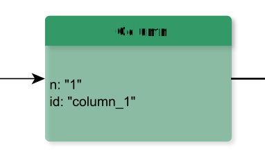

# Column

**Column** represents any column of text.

**Name**: Column

**Type**: Node

**Subclass of**: [Zone](../../../Abstract%20Model/Nodes/Zone.md)

## Properties

* *@id*
  * **name**: [id](../Properties/properties.md#id)
  * **datatype**: string
  * **status**: optional
* *@n*
  * **name**: [n](../Properties/properties.md#n)
  * **datatype**: string
  * **status**: required

## Domain of Relations

* [contains](../Relations/contains.md) (to [Line](Line.md) and [Alternatives](Alternatives.md))

## Range of Relations

* [annotates](../Relations/annotates.md) (from [Annotation](Annotation.md))
* [expressedAs](../Relations/expressedAs.md) (from [Alternative](Alternative.md))
* [mentions](../Relations/mentions.md) (from [Annotation](Annotation.md))
* [contains](../Relations/contains.md) (from [Surface](Surface.md))

## Examples

