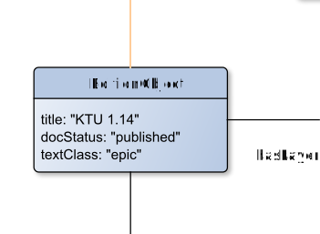

# EditionObject

**EditionObject** represents a clay tablet.

**Name**: EditionObject

**Type**: Node

**Subclass of**: [EditionObject](../../../Abstract%20Model/Nodes/EditionObject.md)

## Properties

* *@docStatus*
  * **name**: [docStatus](../Properties/properties.md#docStatus)
  * **datatype**: string
  * **values**: ('draft', 'published')
  * **status**: required

* *@textClass*
  * **name**: [textClass](../Properties/properties.md#textClass)
  * **datatype**: string
  * **values**: ('epic' (Epic), 'historiola' (Historiola), 'hymn' (Hymnus), 'incantation' (Beschwörung), 'prayer' (Gebet), 'ritual' (Ritual))
  * **status**: required

* *@title*
  * **name**: [title](../Properties/properties.md#title)
  * **datatype**: string
  * **status**: required

## Domain of Relations

* [hasLayer](../Relations/hasLayer.md) (to [TransliterationLayer](TransliterationLayer.md) and [VocalisationLayer](VocalisationLayer.md))
* [hasEditor](../Relations/hasEditor.md) (to [Editor](Editor.md)
* [hasEncodingDesc](../Relations/hasEncodingDesc.md) (to [EncodingDesc](EncodingDesc.md))
* [hasExternalResource](../Relations/hasExternalResource.md) (to [ExternalResource](ExternalResource.md))
* [hasLicence](../Relations/hasLicence.md) (to [Licence](LicenceNode.md))
* [hasProfileDesc](../Relations/hasProfileDesc.md) (to [ProfileDesc](ProfileDesc.md))
* [hasRevisionDesc](../Relations/hasRevisionDesc.md) (to [RevisionDesc](RevisionDesc.md)
* [hasSeriesStmt](../Relations/hasSeriesStmt.md) (to [SeriesStmt](SeriesStmt.md)
* [hasSourceDesc](../Relations/hasSourceDesc.md) (to [SourceDesc](SourceDesc.md))

## Range of Relations

* [annotates](../Relations/annotates.md) (from [Annotation](Annotation.md))
* [mentions](../Relations/mentions.md) (from [Annotation](Annotation.md))

## Examples

