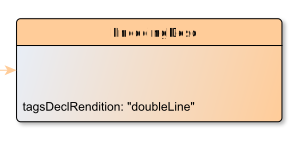

# EncodingDesc

**EncodingDesc** documents the relationship between an electronic text and the source or sources from which it was derived.

**Name**: EncodingDesc

**Type**: Node

**Subclass of**: [Metadata](../../../Abstract%20Model/Nodes/Metadata.md)

## Properties

* *@tagsDeclRendition*
  * **name**: [tagsDeclRendition](../Properties/properties.md#tagsDeclRendition)
  * **datatype**: string
  * **status**: required

## Domain of Relations

None

## Range of Relations

* [hasEncodingDesc](../Relations/hasEncodingDesc.md) (from [EditionObject](EditionObject.md)

## Examples

