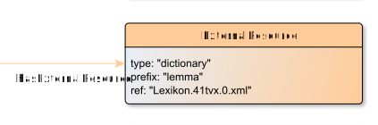

# ExternalResource

**ExternalResource** represents a ExternalResource for an EditionObject.

**Name**: ExternalResource

**Type**: Node

**Subclass of**: [Metadata](../../../Abstract%20Model/Nodes/Metadata.md)

## Properties

* *@prefix*
  * **name**: [prefix](../Properties/properties.md#prefix)
  * **datatype**: string
  * **status**: required

* *@ref*
  * **name**: [ref](../Properties/properties.md#ref)
  * **datatype**: URI
  * **status**: optional

* *@type*
  * **name**: [type](../Properties/properties.md#type)
  * **datatype**: string
  * **status**: required

## Domain of Relations

None

## Range of Relations

* [hasExternalResource](../Relations/hasExternalResource.md) (from [EditionObject](EditionObject.md)

## Examples

