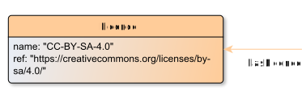

# Licence

**Licence** represents the Licence for an EditionObject.

**Name**: Licence

**Type**: Node

**Subclass of**: [Metadata](../../../Abstract%20Model/Nodes/Metadata.md)

## Properties

* *@name*
  * **name**: [name](../Properties/properties.md#name)
  * **datatype**: string
  * **status**: required

* *@ref*
  * **name**: [ref](../Properties/properties.md#ref)
  * **datatype**: URI
  * **status**: optional

## Domain of Relations

None

## Range of Relations

* [hasLicence](../Relations/hasLicence.md) (from [EditionObject](EditionObject.md)

## Examples

