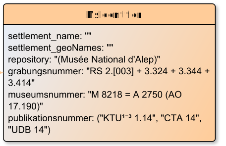

# MsIdentifier

**MsIdentifier** contains the information required to identify the manuscript or similar object being described.

**Name**: MsIdentifier

**Type**: Node

**Subclass of**: [Metadata](../../../Abstract%20Model/Nodes/Metadata.md)

## Properties

* *@grabungsnummer*
  * **name**: [grabungsnummer](../Properties/properties.md#grabungsnummer)
  * **datatype**: string
  * **status**: optional

* *@museumsnummer*
  * **name**: [museumsnummer](../Properties/properties.md#museumsnummer)
  * **datatype**: string
  * **status**: optional

* *@publikationsnummer*
  * **name**: [publikationsnummer](../Properties/properties.md#publikationsnummer)
  * **datatype**: string
  * **status**: optional

* *@repository*
  * **name**: [repository](../Properties/properties.md#repository)
  * **datatype**: string
  * **status**: optional

* *@settlement_name*
  * **name**: [settlement_name](../Properties/properties.md#settlement_name)
  * **datatype**: string
  * **status**: optional

* *@settlement_geoNames*
  * **name**: [settlement_geoNames](../Properties/properties.md#settlement_geoNames)
  * **datatype**: URI
  * **status**: optional

## Domain of Relations

None

## Range of Relations

* [hasMsIdentifier](../Relations/hasMsIdentifier.md) (from [SourceDesc](SourceDesc.md)

## Examples

