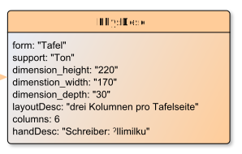

# PhysDesc

**PhysDesc** contains a full physical description of a manuscript, manuscript part, or other object.

**Name**: PhysDesc

**Type**: Node

**Subclass of**: [Metadata](../../../Abstract%20Model/Nodes/Metadata.md)

## Properties

* *@dimension_depth*
  * **name**: [dimension_depth](../Properties/properties.md#dimension_depth)
  * **datatype**: string
  * **status**: required

* *@dimension_height*
  * **name**: [dimension_height](../Properties/properties.md#dimension_height)
  * **datatype**: string
  * **status**: required

* *@dimension_width*
  * **name**: [dimension_width](../Properties/properties.md#dimension_width)
  * **datatype**: string
  * **status**: required

* *@form*
  * **name**: [form](../Properties/properties.md#form)
  * **datatype**: string
  * **status**: required

* *@handDesc*
  * **name**: [handDesc](../Properties/properties.md#handDesc)
  * **datatype**: string
  * **status**: required

* *@layoutDesc*
  * **name**: [layoutDesc](../Properties/properties.md#layoutDesc)
  * **datatype**: string
  * **status**: required

* *@support*
  * **name**: [support](../Properties/properties.md#support)
  * **datatype**: string
  * **status**: required

## Domain of Relations

None

## Range of Relations

* [hasPhysDesc](../Relations/hasPhysDesc.md) (from [SourceDesc](SourceDesc.md)

## Examples

