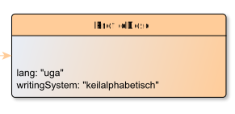

# ProfileDesc

**ProfileDesc** provides a detailed description of non-bibliographic aspects of a text, specifically the languages and sublanguages used, the situation in which it was produced, the participants and their setting.

**Name**: ProfileDesc

**Type**: Node

**Subclass of**: [Metadata](../../../Abstract%20Model/Nodes/Metadata.md)

## Properties

* *@lang*
  * **name**: [lang](../Properties/properties.md#lang)
  * **datatype**: xsd:language
  * **status**: required

* *@writingSystem*
  * **name**: [writingSystem](../Properties/properties.md#writingSystem)
  * **datatype**: string
  * **status**: required

## Domain of Relations

None

## Range of Relations

* [hasProfileDesc](../Relations/hasProfileDesc.md) (from [EditionObject](EditionObject.md)

## Examples

