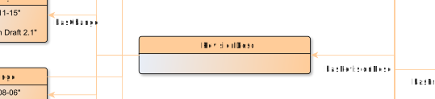

# RevisionDesc

**RevisionDesc** summarizes the revision history for an EditionObject.

**Name**: RevisionDesc

**Type**: Node

**Subclass of**: [Metadata](../../../Abstract%20Model/Nodes/Metadata.md)

## Properties

None

## Domain of Relations

* [hasChange](../Relations/hasChange.md) (to [Change](Change.md)

## Range of Relations

* [hasRevisionDesc](../Relations/hasRevisionDesc.md) (from [EditionObject](EditionObject.md)

## Examples

