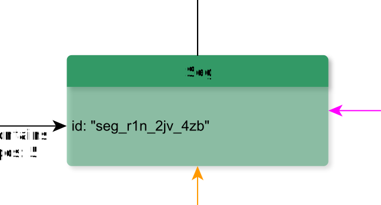

# Seg

**Seg** (arbitrary segment) represents any segmentation of text below the ‘chunk’ level.

**Name**: Seg

**Type**: Node

**Subclass of**: [GraphicalUnit](../../../Abstract%20Model/Nodes/GraphicalUnit.md)

## Properties

* *@id*
  * **name**: [id](../Properties/properties.md#id)
  * **datatype**: string
  * **status**: required

## Domain of Relations

* [contains](../Relations/contains.md) (to [Sign](Sign.md) and [Alternatives](Alternatives.md))

## Range of Relations

* [annotates](../Relations/annotates.md) (from [Annotation](Annotation.md))
* [expressedAs](../Relations/expressedAs.md) (from [Alternative](Alternative.md))
* [mentions](../Relations/mentions.md) (from [Annotation](Annotation.md))
* [contains](../Relations/contains.md) (from [Line](Line.md) and [Part](Part.md))
* [refersTo](../Relations/refersTo.md) (from [Word](Word.md))

## Examples

