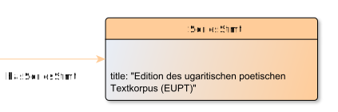

# SeriesStmt

**SeriesStmt** represents a SeriesStmt for an EditionObject.

**Name**: SeriesStmt

**Type**: Node

**Subclass of**: [Metadata](../../../Abstract%20Model/Nodes/Metadata.md)

## Properties

* *@title*
  * **name**: [title](../Properties/properties.md#title)
  * **datatype**: string
  * **status**: required

## Domain of Relations

None

## Range of Relations

* [hasSeriesStmt](../Relations/hasSeriesStmt.md) (from [EditionObject](EditionObject.md)

## Examples

