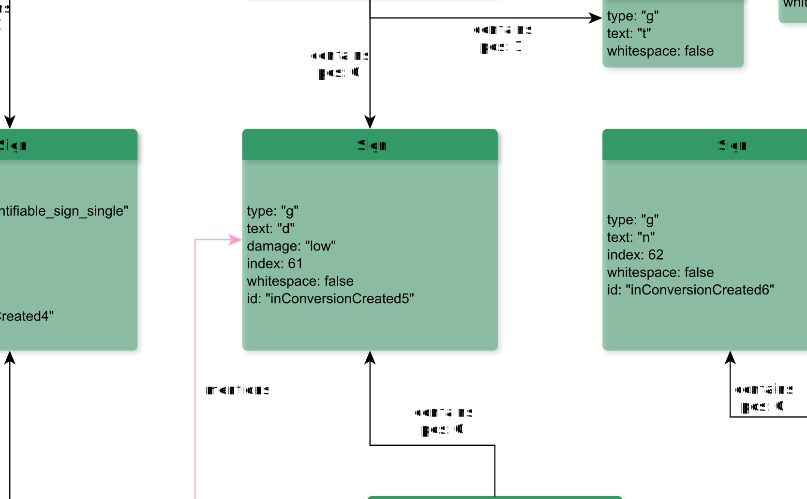

# Sign

**Sign** represents a single sign, either glyph or punctuation marc.

**Name**: Sign

**Type**: Node

**Subclass of**: [GraphicalUnit](../../../Abstract%20Model/Nodes/GraphicalUnit.md)

## Properties

* *@damage*
  * **name**: [damage](../Properties/properties.md#damage)
  * **datatype**: string
  * **values**: ('high', 'low')
  * **status**: optional

* *@id*
  * **name**: [id](../Properties/properties.md#id)
  * **datatype**: string
  * **status**: optional

* *@index*
  * **name**: [index](../Properties/properties.md#index)
  * **datatype**: integer
  * **status**: optional

* *@text*
  * **name**: [text](../Properties/properties.md#text)
  * **datatype**: string
  * **status**: required

* *@type*
  * **name**: [type](../Properties/properties.md#type)
  * **datatype**: string
  * **values**: ('g', 'pc')
  * **status**: required

* *@subtype*
  * **name**: [subtype](../Properties/properties.md#subtype)
  * **datatype**: string
  * **status**: optional

* *@whitespace*
  * **name**: [whitespace](../Properties/properties.md#whitespace)
  * **datatype**: string
  * **status**: required

## Domain of Relations

None

## Range of Relations

* [annotates](../Relations/annotates.md) (from [Annotation](Annotation.md))
* [expressedAs](../Relations/expressedAs.md) (from [Alternative](Alternative.md))
* [mentions](../Relations/mentions.md) (from [Annotation](Annotation.md))
* [contains](../Relations/contains.md) (from [Line](Line.md), [Part](Part.md), and [Seg](Seg.md))

## Examples

