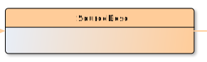

# SourceDesc

**SourceDesc** describes the source(s) from which an electronic text was derived or generated, typically a bibliographic description in the case of a digitized text, or a phrase such as ‘born digital’ for a text which has no previous existence.

**Name**: SourceDesc

**Type**: Node

**Subclass of**: [Metadata](../../../Abstract%20Model/Nodes/Metadata.md)

## Properties

None

## Domain of Relations

* [hasAbstract](../Relations/hasAbstract.md) (to [Abstract](Abstract.md)
* [hasAdditional](../Relations/hasAdditional.md) (to [Additional](Additional.md)
* [hasMsIdentifier](../Relations/hasMsIdentifier.md) (to [MsIdentifier](MsIdentifier.md)
* [hasPhysDesc](../Relations/hasPhysDesc.md) (to [PhysDesc](PhysDesc.md)

## Range of Relations

* [hasSourceDesc](../Relations/hasSourceDesc.md) (from [EditionObject](EditionObject.md)

## Examples

