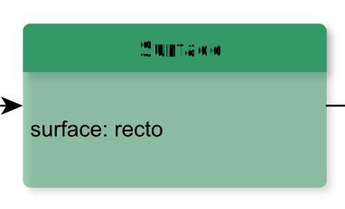

# Surface

**Surface** defines a written surface as a two-dimensional coordinate space, optionally grouping one or more graphic representations of that space, zones of interest within that space, and, when using an embedded transcription approach, transcriptions of the writing within them.

**Name**: Surface

**Type**: Node

**Subclass of**: [Surface](../../../Abstract%20Model/Nodes/Surface.md)

## Properties

* *@surface*
  * **name**: [surface](../Properties/properties.md#surface)
  * **datatype**: string
  * **values**: ('recto', 'verso')
  * **status**: optional

## Domain of Relations

* [contains](../Relations/contains.md) (to [Column](Column.md) and [Alternatives](Alternatives.md))

## Range of Relations

* [annotates](../Relations/annotates.md) (from [Annotation](Annotation.md))
* [expressedAs](../Relations/expressedAs.md) (from [Alternative](Alternative.md))
* [mentions](../Relations/mentions.md) (from [Annotation](Annotation.md))
* [contains](../Relations/contains.md) (from [TransliterationLayer](TransliterationLayer.md))

## Examples

