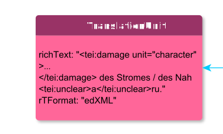

# TranslationUnit

**TranslationUnit** represents a translation.

**Name**: Name

**Type**: Node

**Subclass of**: [TranslationUnit](../../../Abstract%20Model/Nodes/TranslationUnit.md)

## Properties

* *@content*
  * **name**: [content](../Properties/properties.md#content)
  * **datatype**: string
  * **status**: required
* *@mimeType*
  * **name**: [mimeType](../Properties/properties.md#mimeType)
  * **datatype**: string
  * **status**: required

## Domain of Relations

None

## Range of Relations

* [annotates](../Relations/annotates.md) (from [Annotation](Annotation.md))
* [expressedAs](../Relations/expressedAs.md) (from [Alternative](Alternative.md))
* [mentions](../Relations/mentions.md) (from [Annotation](Annotation.md))
* [translatedAs](../Relations/translatedAs.md) (from [Colon](Colon.md))

## Examples

