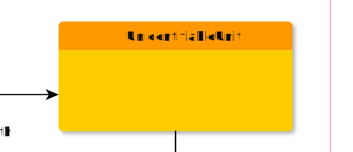

# UnidentifiableUnit

**UnidentifiableUnit** represents a bunch of non-identifiable signs.

**Name**: UnidentifiableUnit

**Type**: Node

**Subclass of**: [Word](../../../Abstract%20Model/Nodes/Word.md)

## Properties

None

## Domain of Relations

* [contains](../Relations/contains.md) (to [UnidentifiableSign](UnidentifiableSign.md) and [Alternatives](Alternatives.md))

## Range of Relations

* [annotates](../Relations/annotates.md) (from [Annotation](Annotation.md))
* [expressedAs](../Relations/expressedAs.md) (from [Alternative](Alternative.md))
* [mentions](../Relations/mentions.md) (from [Annotation](Annotation.md))
* [contains](../Relations/contains.md) (from [Phrase](Phrase.md))

## Examples

