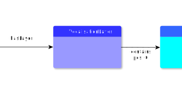

# VocalisationLayer

**VocalisationLayer** represents the vocalisation.

**Name**: VocalisationLayer

**Type**: Node

**Subclass of**: [TextInformationLayer](../../../Abstract%20Model/Nodes/TextInformationLayer.md)

## Properties

None

## Domain of Relations

* [contains](../Relations/contains.md) (to [Stanza](Stanza.md), [Verse](Verse.md), and [Alternatives](Alternatives.md))

## Range of Relations

* [annotates](../Relations/annotates.md) (from [Annotation](Annotation.md))
* [hasLayer](../Relations/hasLayer.md) (from [EditionObject](EditionObject.md))
* [mentions](../Relations/mentions.md) (from [Annotation](Annotation.md))

## Examples

