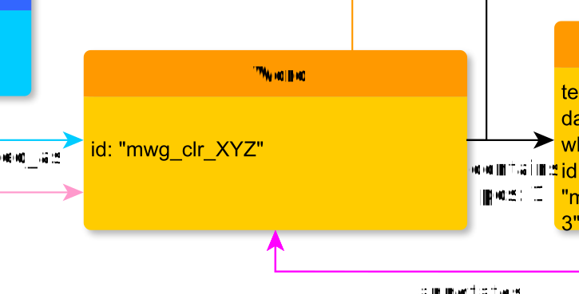

# Word

**Character** represents a grammatical (not necessarily orthographic) word.

**Name**: Word

**Type**: Node

**Subclass of**: [Word](../../../Abstract%20Model/Nodes/Word.md)

## Properties

* *@cert*
  * **name**: [cert](../Properties/properties.md#cert)
  * **datatype**: string
  * **values**: ('high', 'low')
  * **status**: optional

* *@id*
  * **name**: [id](../Properties/properties.md#id)
  * **datatype**: string
  * **status**: optional

## Domain of Relations

* [contains](../Relations/contains.md) (to [Character](Character.md))
* [refersTo](../Relations/refersTo.md) (to [Seg](Seg.md))

## Range of Relations

* [annotates](../Relations/annotates.md) (from [Annotation](Annotation.md))
* [expressedAs](../Relations/expressedAs.md) (from [Alternative](Alternative.md))
* [mentions](../Relations/mentions.md) (from [Annotation](Annotation.md))
* [contains](../Relations/contains.md) (from [Phrase](Phrase.md))

## Examples

