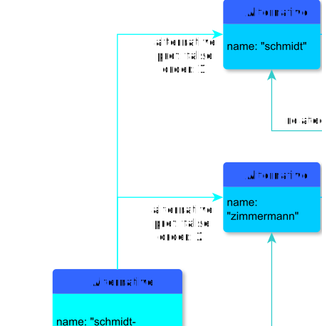

# alternative

**alternative** defines which Alternative relates to Alternatives

**name**: alternative

**Type**: Relation

**Subclass of**: [alternative](../../../Abstract%20Model/Relations/alternative.md)

## Properties

* *@order*
  * **name**: [order](../Properties/properties.md#order)
  * **datatype**: integer
  * **status**: required
* *@pref*
  * **name**: [pref](../Properties/properties.md#pref)
  * **datatype**: boolean
  * **status**: required

## Domains

* [Alternatives](../Nodes/Alternatives.md) (to [Alternative](../Nodes/Alternative.md))

## Ranges

* [Alternative](../Nodes/Alternative.md) (from [Alternatives](../Nodes/Alternatives.md))

## Examples

