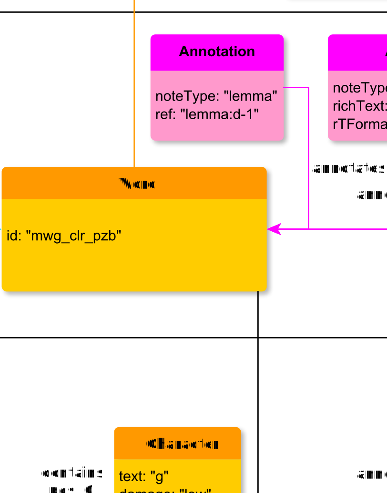

# annotates

**annotates** links an annotation to its object

**name**: annotates

**Type**: Relation

**Subclass of**: [annotates](../../../Abstract%20Model/Relations/annotates.md)

## Properties

None

## Domains

* [Annotation](../Nodes/Annotation.md) (to [Alternative](../Nodes/Alternative.md), [Alternatives](../Nodes/Alternatives.md), [Annotation](../Nodes/Annotation.md), [Thing](../../../Abstract%20Model/Nodes/Thing.md), and [TranslationUnit](../Nodes/TranslationUnit.md))

## Ranges

* [Alternative](../Nodes/Alternative.md) (from [Annotation](../Nodes/Annotation.md))
* [Alternatives](../Nodes/Alternatives.md) (from [Annotation](../Nodes/Annotation.md))
* [Annotation](Annotation.md) (from [Annotation](../Nodes/Annotation.md))
* [Thing](../../../Abstract%20Model/Nodes/Thing.md) (from [Annotation](../Nodes/Annotation.md))
* [TranslationUnit](../Nodes/TranslationUnit.md) (from [Annotation](../Nodes/Annotation.md))

## Example

