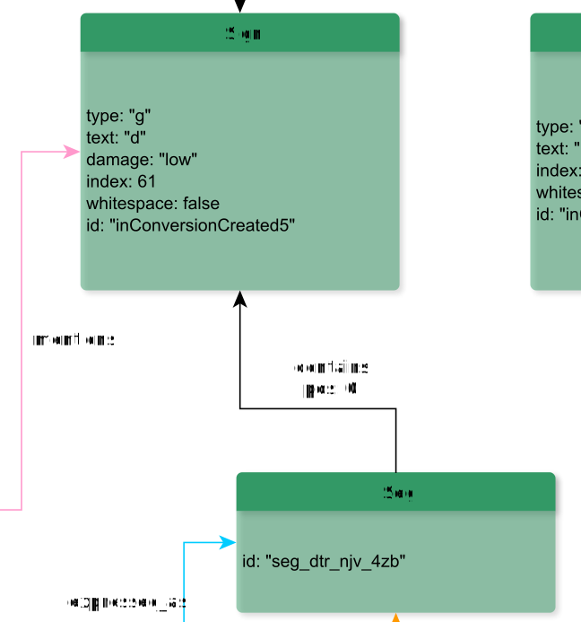

# contains

**contains** places smaller units within bigger units

**Name**: contains

**Type**: Relation

**Subclass of**: [contains](../../../Abstract%20Model/Relations/contains.md)

## Properties

* *@pos*
  * **name**: [pos](../Properties/properties.md#pos)
  * **datatype**: integer
  * **status**: required

## Domains

* [Column](../Nodes/Column.md) (to [Line](../Nodes/Line.md) and [Alternatives](../Nodes/Alternatives.md))
* [Colon](../Nodes/Colon.md) (to [Phrase](Phrase.md), [UnidentifiableUnit](UnidentifiableUnit.md), [Word](Word.md), and [Alternatives](Alternatives.md))
* [Line](../Nodes/Line.md) (to [Part](../Nodes/Part.md), [Seg](../Nodes/Seg.md), [Sign](../Nodes/Sign.md), and [Alternatives](../Nodes/Alternatives.md))
* [Part](../Nodes/Part.md) (to [Seg](../Nodes/Seg.md), [Sign](../Nodes/Sign.md), [Alternatives](../Nodes/Alternatives.md), and itself)
* [Phrase](../Nodes/Phrase.md) (to [Word](../Nodes/Word.md), [UnidentifiableUnit](../Nodes/UnidentifiableUnit.md), [Alternatives](../Nodes/Alternatives.md), and itself)
* [Seg](../Nodes/Seg.md) (to [Sign](../Nodes/Sign.md) and [Alternatives](../Nodes/Alternatives.md))
* [Stanza](../Nodes/Stanza.md) (to [Verse](Verse.md) and [Alternatives](Alternatives.md))
* [Surface](../Nodes/Surface.md) (to [Column](../Nodes/Column.md) and [Alternatives](../Nodes/Alternatives.md))
* [TransliterationLayer](../Nodes/TransliterationLayer.md) (to [Stanza](../Nodes/Stanza.md), [Verse](../Nodes/Verse.md), and [Alternatives](../Nodes/Alternatives.md))
* [UnidentifiableUnit](../Nodes/UnidentifiableUnit.md) (to [UnidentifiableSign](../Nodes/UnidentifiableSign.md) and [Alternatives](Alternatives.md))
* [Verse](../Nodes/Verse.md) (to [Colon](Colon.md) and [Alternatives](Alternatives.md))
* [VocalisationLayer](../Nodes/VocalisationLayer.md) (to [Surface](../Nodes/Surface.md) and [Alternatives](../Nodes/Alternatives.md))
* [Word](../Nodes/Word.md) (to [Character](../Nodes/Character.md) and [Alternatives](../Nodes/Alternatives.md))

## Ranges

* [Alternatives](../Nodes/Alternatives.md) (from [TextUnit](../../../Abstract%20Model/Nodes/TextUnit.md), [TransliterationLayer](../Nodes/TransliterationLayer.md), and [VocalisationLayer](../Nodes/VocalisationLayer.md))
* [Character](../Nodes/Character.md) (from [Word](../Nodes/Word.md))
* [Colon](../Nodes/Colon.md) (from [Verse](Verse.md))
* [Column](../Nodes/Column.md) (from [Surface](../Nodes/Surface.md))
* [Line](../Nodes/Line.md) (from [Column](../Nodes/Column.md))
* [Part](../Nodes/Part.md) (from [Line](../Nodes/Line.md))
* [Phrase](../Nodes/Phrase.md) (from [Colon](../Nodes/Colon.md))
* [Seg](../Nodes/Seg.md) (from [Line](../Nodes/Line.md) and [Part](../Nodes/Part.md))
* [Sign](../Nodes/Sign.md) (from [Line](../Nodes/Line.md), [Part](../Nodes/Part.md), and [Seg](../Nodes/Seg.md))
* [Stanza](../Nodes/Stanza.md) (from [TransliterationLayer](../Nodes/TransliterationLayer.md))
* [Surface](../Nodes/Surface.md) (from [VocalisationLayer](../Nodes/VocalisationLayer.md))
* [UnidentifiableSign](../Nodes/UnidentifiableSign.md) (from [UnidentifiableUnit](../Nodes/UnidentifiableUnit.md))
* [UnidentifiableUnit](../Nodes/UnidentifiableUnit.md) (from [Phrase](../Nodes/Phrase.md) and [Colon](../Nodes/Colon.md))
* [Verse](../Nodes/Verse.md) (from [Stanza](../Nodes/Stanza.md) and [TransliterationLayer](../Nodes/TransliterationLayer.md))
* [Word](../Nodes/Word.md) (from [Phrase](../Nodes/Phrase.md) and [Colon](../Nodes/Colon.md))

## Example

