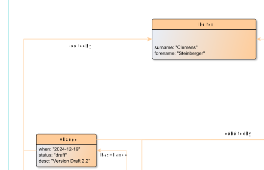

# editedBy

**editedBy** links a Change node to its Editor

**Name**: editedBy

**Type**: Relation

**Subclass of**: [hasMetadata](../../../Abstract%20Model/Relations/hasMetadata.md)

## Properties

None

## Domains

* [Change](../Nodes/Change.md) (to [Editor](../Nodes/Editor.md))

## Ranges

* [Editor](../Nodes/Editor.md) (from [Change](../Nodes/Change.md))

## Example

