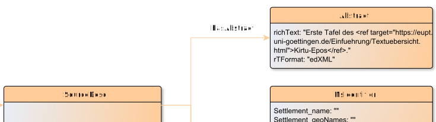

# hasAbstract

**hasAbstract** connects a SourceDesc with Abstract

**Name**: hasAbstract

**Type**: Relation

**Subclass of**: [hasMetadata](../../../Abstract%20Model/Relations/hasMetadata.md)

## Properties

None

## Domains

* [SourceDesc](../Nodes/SourceDesc.md) (to [Abstract](../Nodes/Abstract.md))

## Ranges

* [Abstract](../Nodes/Abstract.md) (from [SourceDesc](../Nodes/SourceDesc.md))

## Example

