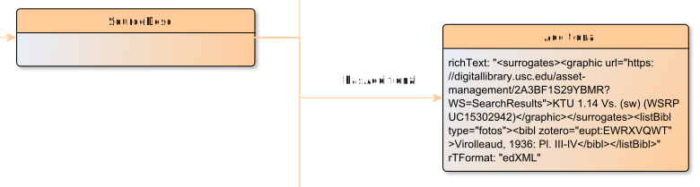

# hasAdditional

**hasAdditional** connects a SourceDesc with Additional

**Name**: hasAdditional

**Type**: Relation

**Subclass of**: [hasMetadata](../../../Abstract%20Model/Relations/hasMetadata.md)

## Properties

None

## Domains

* [SourceDesc](../Nodes/SourceDesc.md) (to [Additional](../Nodes/Additional.md))

## Ranges

* [Additional](../Nodes/Additional.md) (from [SourceDesc](../Nodes/SourceDesc.md))

## Example

