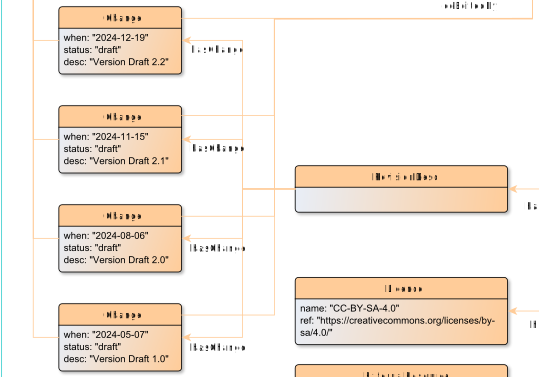

# hasChange

**hasChange** connects a RevisionDesc with a Change

**Name**: hasChange

**Type**: Relation

**Subclass of**: [hasMetadata](../../../Abstract%20Model/Relations/hasMetadata.md)

## Properties

None

## Domains

* [RevisionDesc](../Nodes/RevisionDesc.md) (to [Change](../Nodes/Change.md))

## Ranges

* [Change](../Nodes/Change.md) (from [RevisionDesc](../Nodes/RevisionDesc.md))

## Example

