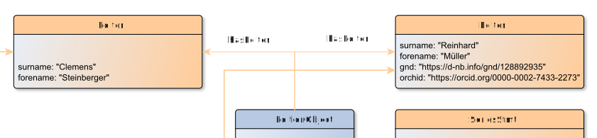

# hasEditor

**hasEditor** connects an EditionObject with its Editor

**Name**: hasEditor

**Type**: Relation

**Subclass of**: [relatedContibutor](../../../Abstract%20Model/Relations/relatedContibutor.md)

## Properties

None

## Domains

* [EditionObject](../Nodes/EditionObject.md) (to [Editor](../Nodes/Editor.md))

## Ranges

* [EditionObject](../Nodes/Editor.md) (from [EditionObject](../Nodes/EditionObject.md))

## Example

