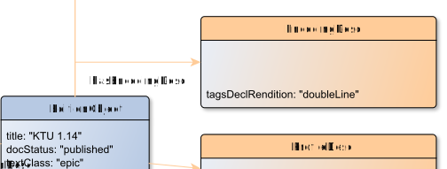

# hasEncodingDesc

**hasEncodingDesc** connects an EditionObject with EncodingDesc

**Name**: hasEncodingDesc

**Type**: Relation

**Subclass of**: [hasMetadata](../../../Abstract%20Model/Relations/hasMetadata.md)

## Properties

None

## Domains

* [EditionObject](../Nodes/EditionObject.md) (to [EncodingDesc](../Nodes/EncodingDesc.md))

## Ranges

* [EncodingDesc](../Nodes/EncodingDesc.md) (from [EditionObject](../Nodes/EditionObject.md))

## Example

