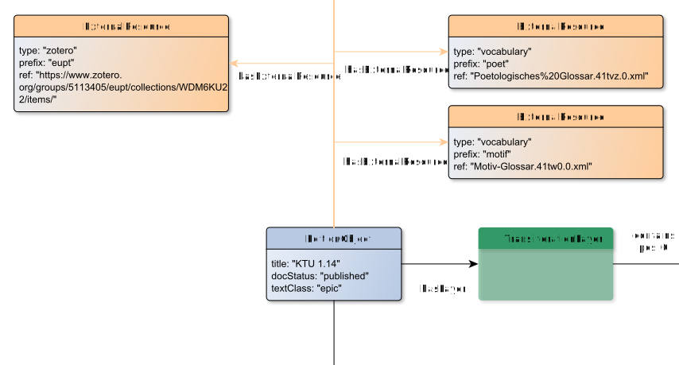

# hasExternalResource

**hasExternalResource** connects an EditionObject with ExternalResource

**Name**: hasExternalResource

**Type**: Relation

**Subclass of**: [hasMetadata](../../../Abstract%20Model/Relations/hasMetadata.md)

## Properties

None

## Domains

* [EditionObject](../Nodes/EditionObject.md) (to [ExternalResource](../Nodes/ExternalResource.md))

## Ranges

* [ExternalResource](../Nodes/ExternalResource.md) (from [EditionObject](../Nodes/EditionObject.md))

## Example

