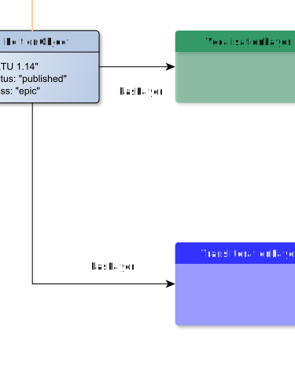

# hasLayer

**hasLayer** connects an EditionObject with TextInformationLayer

**Name**: hasLayer

**Type**: Relation

**Subclass of**: None

## Properties

None

## Domains

* [EditionObject](../Nodes/EditionObject.md) (to [TransliterationLayer](../Nodes/TransliterationLayer.md) and [VocalisationLayer](../Nodes/VocalisationLayer.md))

## Ranges

* [TransliterationLayer](../Nodes/TransliterationLayer.md) (from [EditionObject](../Nodes/EditionObject.md))
* [VocalisationLayer](../Nodes/VocalisationLayer.md) (from [EditionObject](../Nodes/EditionObject.md))

## Example

