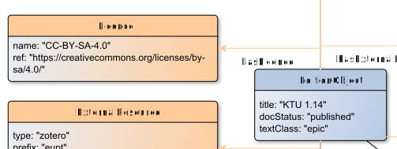

# hasLicence

**hasLicence** connects an EditionObject with Licence

**Name**: hasLicence

**Type**: Relation

**Subclass of**: [hasMetadata](../../../Abstract%20Model/Relations/hasMetadata.md)

## Properties

None

## Domains

* [EditionObject](../Nodes/EditionObject.md) (to [Licence](../Nodes/LicenceNode.md))

## Ranges

* [Licence](../Nodes/LicenceNode.md) (from [EditionObject](../Nodes/EditionObject.md))

## Example

