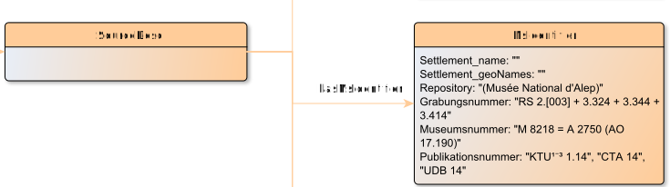

# hasMsIdentifier

**hasMsIdentifier** connects a SourceDesc with MsIdentifier

**Name**: hasMsIdentifier

**Type**: Relation

**Subclass of**: [hasMetadata](../../../Abstract%20Model/Relations/hasMetadata.md)

## Properties

None

## Domains

* [SourceDesc](../Nodes/SourceDesc.md) (to [MsIdentifier](../Nodes/MsIdentifier.md))

## Ranges

* [MsIdentifier](../Nodes/MsIdentifier.md) (from [SourceDesc](../Nodes/SourceDesc.md))

## Example

