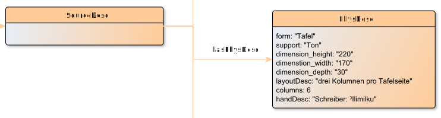

# hasPhysDesc

**hasPhysDesc** connects a SourceDesc with PhysDesc

**Name**: hasPhysDesc

**Type**: Relation

**Subclass of**: [hasMetadata](../../../Abstract%20Model/Relations/hasMetadata.md)

## Properties

None

## Domains

* [SourceDesc](../Nodes/SourceDesc.md) (to [PhysDesc](../Nodes/PhysDesc.md))

## Ranges

* [PhysDesc](../Nodes/PhysDesc.md) (from [SourceDesc](../Nodes/SourceDesc.md))

## Example

