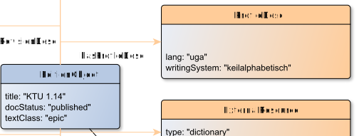

# hasProfileDesc

**hasProfileDesc** connects an EditionObject with ProfileDesc

**Name**: hasProfileDesc

**Type**: Relation

**Subclass of**: [hasMetadata](../../../Abstract%20Model/Relations/hasMetadata.md)

## Properties

None

## Domains

* [EditionObject](../Nodes/EditionObject.md) (to [ProfileDesc](../Nodes/ProfileDesc.md))

## Ranges

* [ProfileDesc](../Nodes/ProfileDesc.md) (from [EditionObject](../Nodes/EditionObject.md))

## Example

