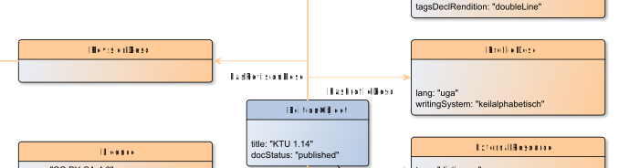

# hasRevisionDesc

**hasRevisionDesc** connects an EditionObject with RevisionDesc

**Name**: hasRevisionDesc

**Type**: Relation

**Subclass of**: [hasMetadata](../../../Abstract%20Model/Relations/hasMetadata.md)

## Properties

None

## Domains

* [EditionObject](../Nodes/EditionObject.md) (to [RevisionDesc](../Nodes/RevisionDesc.md))

## Ranges

* [RevisionDesc](../Nodes/RevisionDesc.md) (from [EditionObject](../Nodes/EditionObject.md))

## Example

