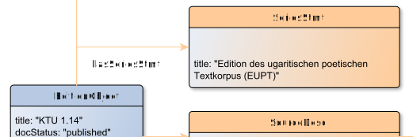

# hasSeriesStmt

**hasSeriesStmt** connects an EditionObject with SeriesStmt

**Name**: hasSeriesStmt

**Type**: Relation

**Subclass of**: [hasMetadata](../../../Abstract%20Model/Relations/hasMetadata.md)

## Properties

None

## Domains

* [EditionObject](../Nodes/EditionObject.md) (to [SeriesStmt](../Nodes/SeriesStmt.md))

## Ranges

* [SeriesStmt](../Nodes/SeriesStmt.md) (from [EditionObject](../Nodes/EditionObject.md))

## Example

