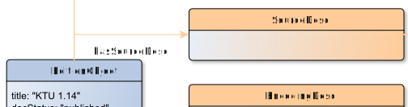

# hasSourceDesc

**hasSourceDesc** connects an EditionObject with SourceDesc

**Name**: hasSourceDesc

**Type**: Relation

**Subclass of**: [hasMetadata](../../../Abstract%20Model/Relations/hasMetadata.md)

## Properties

None

## Domains

* [EditionObject](../Nodes/EditionObject.md) (to [SourceDesc](../Nodes/SourceDesc.md))

## Ranges

* [SourceDesc](../Nodes/SourceDesc.md) (from [EditionObject](../Nodes/EditionObject.md))

## Example

