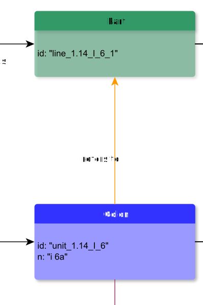

# refersTo

**refersTo** indicates a non-hierarchical connection to a GrammaticalUnit

**name**: refersTo

**Type**: Relation

**Subclass of**: [refersTo](../../../Abstract%20Model/Relations/refersTo.md)

## Properties

None

## Domains

* [Colon](../Nodes/Colon.md) (to [Part](../Nodes/Part.md))
* [Word](../Nodes/Word.md) (to [Seg](../Nodes/Seg.md))

## Ranges

* [Part](../Nodes/Part.md) (from [Colon](../Nodes/Colon.md))
* [Seg](../Nodes/Seg.md) (from [Word](../Nodes/Word.md))

## Examples

