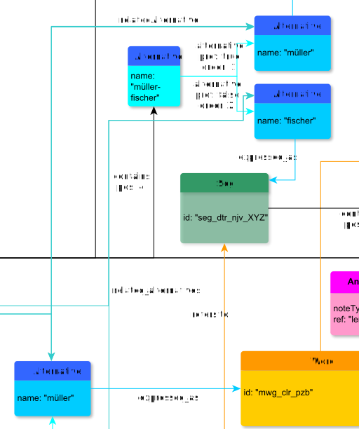

# relatedAlternative

**relatedAlternative** relates two Alternative-nodes with each other.

**name**: relatedAlternative

**Type**: Relation

**Subclass of**: [relatedAlternative](../../../Abstract%20Model/Relations/relatedAlternative.md)

## Properties

None

## Domains

* [Alternative](../Nodes/Alternative.md) (to itself)

## Ranges

* [Alternative](../Nodes/Alternative.md) (from itself)

## Examples

