# GraphDBNext Architecture Diagrams

This document contains Mermaid diagrams illustrating the various architectural aspects, design patterns, and system layers of the GraphDBNext application.

---
config:
  layout: dagre
---
flowchart TB
 subgraph MD["Option A: Markdown-based Model"]
        MD1["Download MD Template"]
        U["User"]
        MD2["Fill Template"]
        MD3["Upload MD File"]
        MD4["Generate JSON Model Schema"]
  end
 subgraph XML["Option B: XML-based Model"]
        XML1["Upload XML File"]
        XML2["Generate XML Tree"]
        XML3["Visual Canvas"]
        XML4["Define Nodes & Edges"]
        XML5["Generate JSON Model Schema"]
  end
 subgraph SCHEMA["Model Schema Creation"]
    direction TB
        MD
        XML
  end
 subgraph GRAPH["Graph JSON Generation"]
    direction TB
        G1["Model Schema Ready"]
        SCHEMA
        G2["Upload XML Data"]
        G3["Map XML Elements to Schema"]
        G4["Nodes / Edges / Properties / Values"]
        G5["Generate Graph JSON"]
  end
 subgraph DB["Graph Database Layer"]
        DB1["Push to Graph DB"]
        NEO["Neo4j"]
        MEM["Memgraph"]
  end
 subgraph QUERY["Query & Visualization"]
        Q1["User Queries"]
        Q2["Query Engine"]
        Q3["Tabular Results"]
        Q4["Visualized Results"]
        Q5["HTML Graph Rendering"]
  end
    U --> APP["Web Application"] & MD1 & XML1 & Q1
    MD1 --> MD2
    MD2 --> MD3
    MD3 --> MD4
    XML1 --> XML2
    XML2 --> XML3
    XML3 --> XML4
    XML4 --> XML5
    SCHEMA --> G1
    G1 --> G2
    G2 --> G3
    G3 --> G4
    G4 --> G5
    G5 --> DB1
    DB1 -- Neo4j --> NEO
    DB1 -- Memgraph --> MEM
    Q1 --> Q2
    Q2 --> Q3 & Q4 & Q5
    DB --> QUERY

## 1. Overall System Architecture

graph TB
    subgraph "Client Layer"
        UI[React/Next.js Frontend]
        MB[Model Builder Package]
    end

    subgraph "API Layer"
        API[Next.js API Routes]
        AIS[AI Settings API]
        DB_API[Database API]
        XML_API[XML Processing API]
    end

    subgraph "Business Logic Layer"
        Services[Application Services]
        WF[Workflow Engine]
        AI[AI Integration Services]
    end

    subgraph "Data Layer"
        PG[(PostgreSQL)]
        MG[(Memgraph/Neo4j)]
        Cache[(Redis Cache)]
    end

    subgraph "External APIs"
        WD[Wikidata]
        EU[Europeana]
        OR[ORCID]
        GN[GeoNames]
        CR[CrossRef]
    end

    UI --> API
    MB --> API
    API --> Services
    Services --> WF
    Services --> AI
    WF --> PG
    WF --> MG
    AI --> PG
    Services --> PG
    Services --> MG
    WF --> WD
    WF --> EU
    WF --> OR
    WF --> GN
    WF --> CR

    style UI fill:#e1f5fe
    style MB fill:#e1f5fe
    style API fill:#fff3e0
    style Services fill:#e8f5e8
    style WF fill:#e8f5e8
    style AI fill:#e8f5e8
    style PG fill:#fce4ec
    style MG fill:#fce4ec
    style WD fill:#f3e5f5
    style EU fill:#f3e5f5

## 2. Application Layered Architecture

graph TB
    subgraph "Presentation Layer"
        UI[User Interface]
        API[API Gateway]
        MB[Model Builder UI]
    end

    subgraph "Application Layer"
        CTL[Controllers]
        DTO[Data Transfer Objects]
        VAL[Validators]
        AUTH[Authentication]
    end

    subgraph "Domain Layer"
        ENT[Entities/Models]
        SRV[Domain Services]
        WF_SRV[Workflow Services]
        AI_SRV[AI Services]
    end

    subgraph "Infrastructure Layer"
        REPO[Repositories]
        DB_CTX[Database Context]
        EXT_API[External API Clients]
        FILE_SYS[File System]
        CACHE[Cache Providers]
    end

    subgraph "External Systems"
        PG_DB[(PostgreSQL)]
        GRAPH_DB[(Graph DB)]
        AI_PROV[AI Providers]
        EXT_SERV[External Services]
    end

    UI --> CTL
    MB --> CTL
    API --> CTL
    CTL --> DTO
    CTL --> VAL
    CTL --> AUTH
    CTL --> SRV
    SRV --> WF_SRV
    SRV --> AI_SRV
    WF_SRV --> ENT
    AI_SRV --> ENT
    SRV --> REPO
    REPO --> DB_CTX
    DB_CTX --> PG_DB
    DB_CTX --> GRAPH_DB
    EXT_API --> AI_PROV
    EXT_API --> EXT_SERV
    CACHE --> FILE_SYS

    style UI fill:#e3f2fd
    style API fill:#e3f2fd
    style MB fill:#e3f2fd
    style CTL fill:#fff8e1
    style SRV fill:#e8f5e8
    style WF_SRV fill:#e8f5e8
    style AI_SRV fill:#e8f5e8
    style REPO fill:#fce4ec
    style EXT_API fill:#f3e5f5

## 3. Design Patterns Used

graph TD
    subgraph "Creational Patterns"
        FACTORY[Factory Pattern GraphDatabaseFactory]
        BUILDER[Builder Pattern ModelBuilder]
        SINGLETON[Singleton Pattern Database Connections]
    end

    subgraph "Structural Patterns"
        ADAPTER[Adapter Pattern Database Adapters]
        FACADE[Facade Pattern Service Layer]
        COMPOSITE[Composite Pattern Workflow Nodes]
    end

    subgraph "Behavioral Patterns"
        STRATEGY[Strategy Pattern AI Providers]
        OBSERVER[Observer Pattern State Management]
        COMMAND[Command Pattern Workflow Actions]
        TEMPLATE[Template Method XML Processing]
    end

    subgraph "Architectural Patterns"
        MVC[MVC Pattern Next.js App Router]
        REPO[Repository Pattern Data Access]
        CQRS[CQRS Pattern Read/Write Operations]
        LAYERED[Layered Architecture Presentation → Domain → Infra]
    end

    FACTORY --> ADAPTER
    BUILDER --> COMPOSITE
    SINGLETON --> FACADE
    ADAPTER --> STRATEGY
    FACADE --> REPO
    COMPOSITE --> COMMAND
    STRATEGY --> CQRS
    OBSERVER --> MVC
    COMMAND --> TEMPLATE
    REPO --> LAYERED
    CQRS --> LAYERED
    MVC --> LAYERED
    TEMPLATE --> LAYERED

## 4. Workflow System Architecture

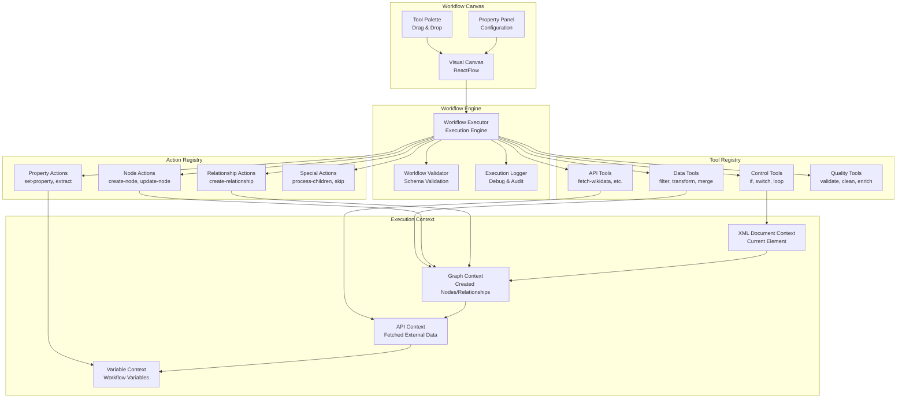

## 5. AI Integration Architecture

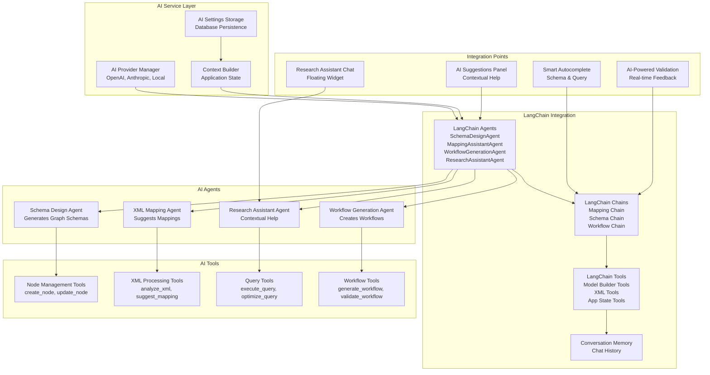

## 6. Database Abstraction Layer

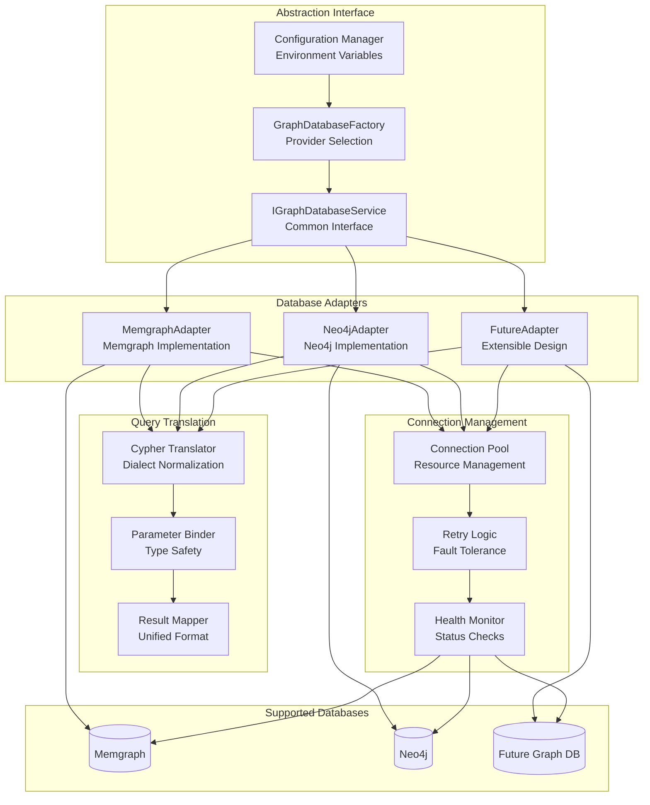

## 7. Data Flow Architecture

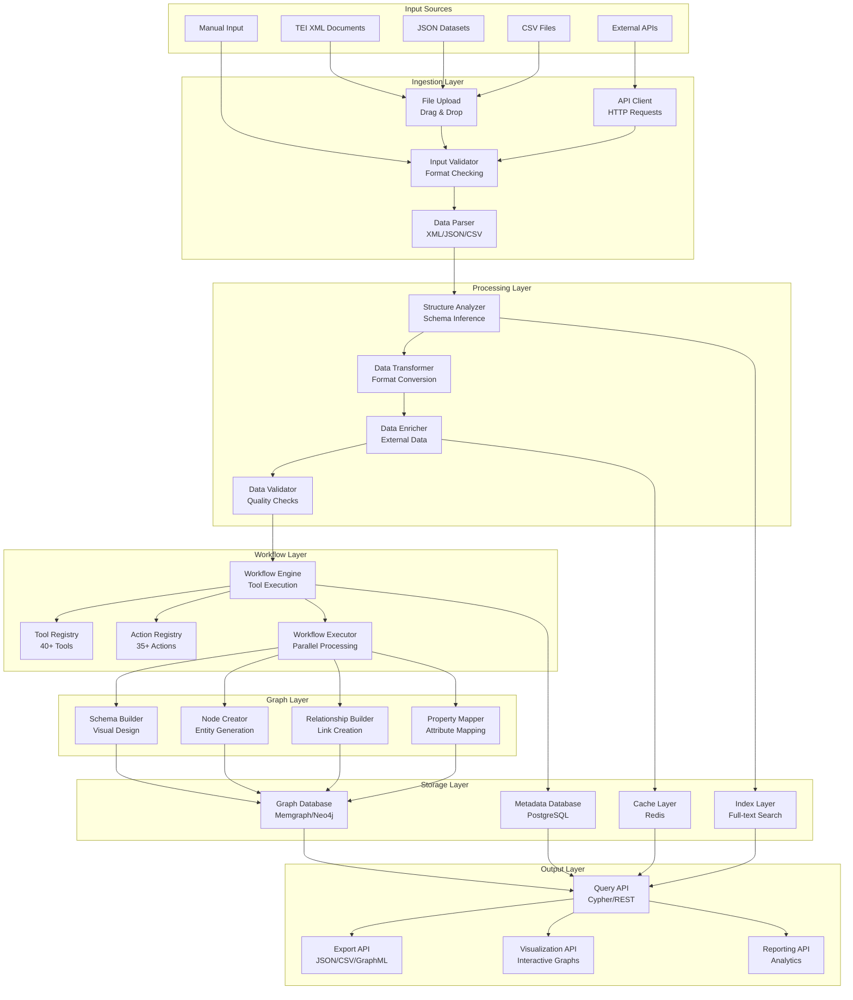

## 8. User Interface Architecture

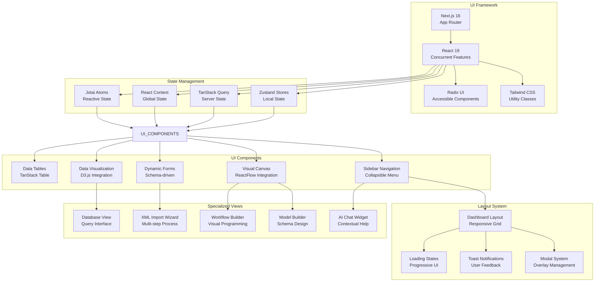

## 9. XML Processing Pipeline

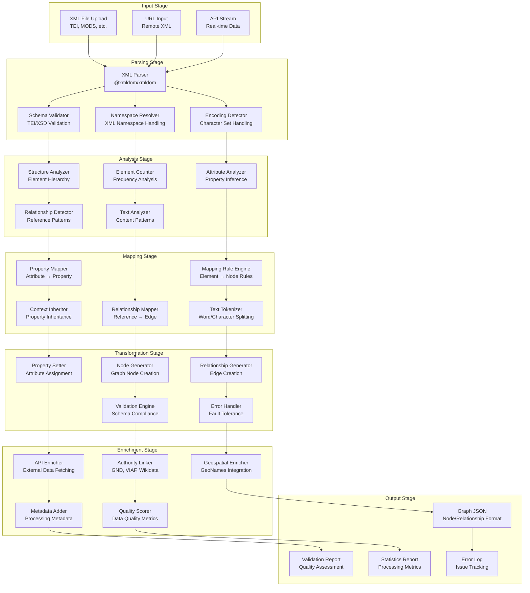

## 10. Deployment Architecture

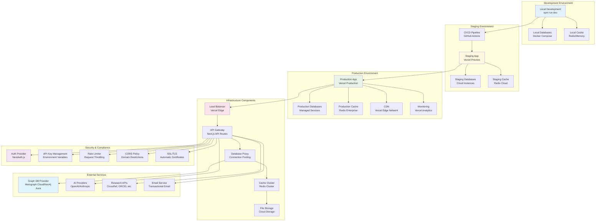

## 11. Component Architecture (Model Builder Package)

```mermaid
graph TD
    subgraph "Core Components"
        MODEL_BUILDER[ModelBuilder<br/>Main Component]
        CANVAS[ModelBuilderCanvas<br/>ReactFlow Canvas]
        PALETTE[NodePalette<br/>Component Library]
        EDITOR[NodeEditor<br/>Property Editor]
    end

    subgraph "Wizard Components"
        XML_WIZARD[XmlImportWizard<br/>Multi-step Import]
        WF_BUILDER[WorkflowBuilder<br/>Visual Workflow Editor]
        MAPPING_CONFIG[XmlMappingConfigurator<br/>Mapping Rules]
    end

    subgraph "UI Primitives"
        DIALOG[Dialog Components<br/>Modals & Popups]
        FORM[Form Components<br/>Input Controls]
        TABLE[Table Components<br/>Data Display]
        CHART[Chart Components<br/>Visualizations]
        SIDEBAR[Sidebar Components<br/>Navigation]
    end

    subgraph "Specialized Components"
        AI_CHAT[AIChatbot<br/>Research Assistant]
        AI_SUGGESTIONS[AISuggestionPanel<br/>Contextual Help]
        WF_CANVAS[WorkflowCanvas<br/>Tool/Action Editor]
        DB_CONNECTOR[DatabaseConnector<br/>Connection Manager]
    end

    subgraph "Hooks & Utilities"
        USE_SCHEMA[useSchema Hooks<br/>Schema Management]
        USE_WORKFLOW[useWorkflow Hooks<br/>Workflow Logic]
        USE_XML[useXml Hooks<br/>XML Processing]
        USE_AI[useAi Hooks<br/>AI Integration]
        UTILS[Utility Functions<br/>Helper Methods]
    end

    subgraph "State Management"
        MODEL_STORE[modelBuilderStore<br/>Schema State]
        WF_STORE[workflowStore<br/>Workflow Steps]
        WF_CANVAS_STORE[workflowCanvasStore<br/>Visual State]
        XML_STORE[xmlImportWizardStore<br/>Import State]
    end

    MODEL_BUILDER --> CANVAS
    MODEL_BUILDER --> PALETTE
    MODEL_BUILDER --> EDITOR
    MODEL_BUILDER --> XML_WIZARD
    MODEL_BUILDER --> WF_BUILDER
    MODEL_BUILDER --> MAPPING_CONFIG

    CANVAS --> DIALOG
    PALETTE --> FORM
    EDITOR --> TABLE
    XML_WIZARD --> CHART
    WF_BUILDER --> SIDEBAR

    MODEL_BUILDER --> AI_CHAT
    MODEL_BUILDER --> AI_SUGGESTIONS
    MODEL_BUILDER --> WF_CANVAS
    MODEL_BUILDER --> DB_CONNECTOR

    CANVAS --> USE_SCHEMA
    XML_WIZARD --> USE_XML
    WF_BUILDER --> USE_WORKFLOW
    AI_CHAT --> USE_AI
    MODEL_BUILDER --> UTILS

    USE_SCHEMA --> MODEL_STORE
    USE_WORKFLOW --> WF_STORE
    WF_CANVAS --> WF_CANVAS_STORE
    USE_XML --> XML_STORE
    USE_AI --> MODEL_STORE
```

## 12. API Integration Patterns

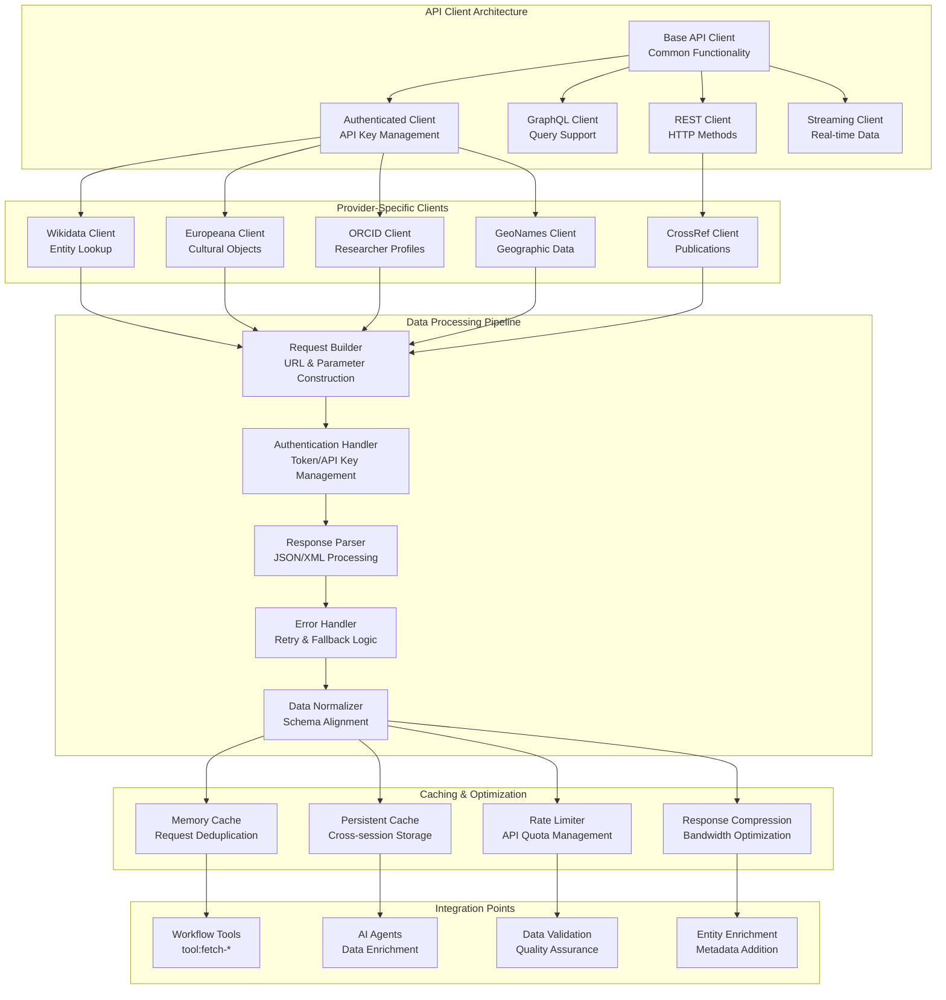

## 13. Performance Optimization Patterns

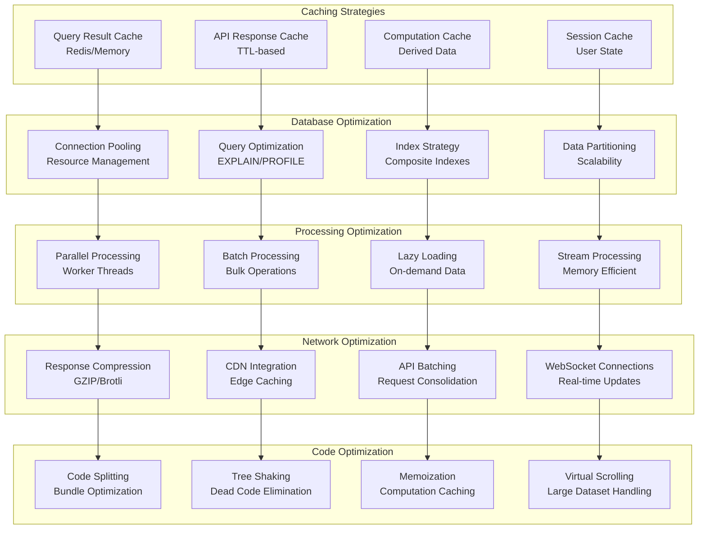

## 14. Security Architecture

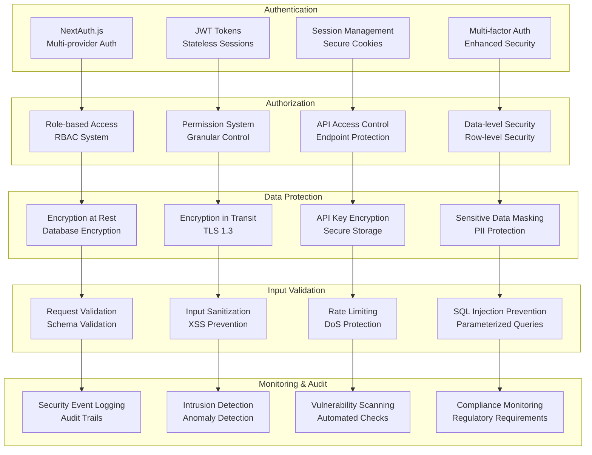

---

## Usage Instructions

These Mermaid diagrams can be rendered in:

1. **GitHub/GitLab**: Direct rendering in Markdown files
2. **VS Code**: With Mermaid Preview extension
3. **Documentation Sites**: Like Docusaurus, MkDocs with Mermaid plugins
4. **Confluence**: With draw.io or Mermaid macros
5. **Presentation Tools**: PowerPoint, Google Slides with Mermaid add-ons

## Legend

- 🟦 **Client Layer**: User interface components
- 🟨 **API Layer**: Backend API endpoints
- 🟩 **Business Logic**: Core application logic
- 🟥 **Data Layer**: Database and storage systems
- 🟪 **External Services**: Third-party APIs and services

Each diagram is designed to be self-contained and can be used independently in presentations, documentation, or technical discussions about the GraphDBNext architecture.
 
