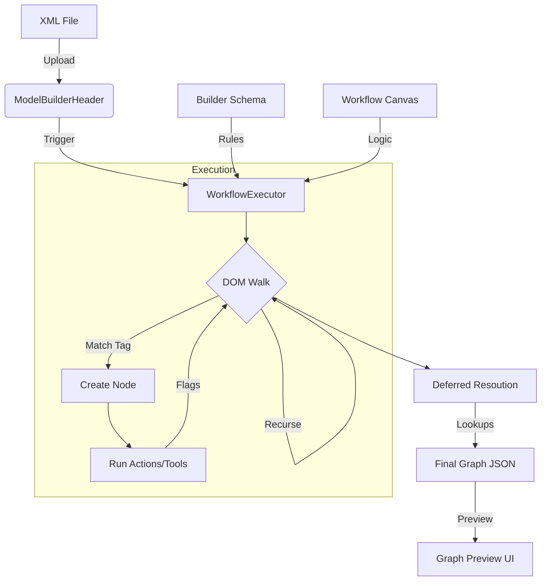

# GraphDBNext Model Builder: Workflow Execution Documentation

This document provides a deep technical analysis of how the Model Builder processes data, executes workflows, and generates the final property graph.

---

## 🏗️ Architectural Overview

The Model Builder follows a **Schema-Driven Pipeline** that converts hierarchical XML data into a semi-structured Property Graph. The process is divided into three main phases: **Definition**, **Execution**, and **Resolution**.

---

## 1. Phase One: The Definition (Setup)

Before execution begins, the user defines the "Rules of Engagement" through the UI components.

### XML Data Source
*   **Upload**: Handled by `ModelBuilderHeader.tsx`. The file is stored as a `File` object and its text content is extracted by `useWorkflowLifecycle.ts`.
*   **Parsing**: The XML string is converted into a DOM tree using `@xmldom/xmldom` during the execution start.

### Schema Design (Builder Nodes & Relationships)
*   **Nodes**: Act as "matchers". Each node in the builder has a `label` that must correspond to an XML tag name (e.g., `<Person>` tags match a `Person` node).
*   **Relationships**: Define how nodes should be connected when they appear in a parent-child relationship within the XML (e.g., `Person` -> `Address` via a `has_address` relationship).

### Workflow logic (Tools & Actions)
*   **Tools**: Handle the logic flow (e.g., `If` conditions, `Switch` branches, or `Fetch API` for external data enrichment).
*   **Actions**: Handle atomic graph mutations (e.g., `Set Property`, `Create Relationship`, `Update Node`).
*   **Connectivity**: Tools and Actions are connected to Builder Nodes via edges. When a Builder Node "matches" an XML element, its attached workflow items are triggered.

---

## 2. Phase Two: The Execution Engine (`executeWorkflow`)

When the "Generate" button is clicked, the `executeWorkflow` service takes over. This is a complex, recursive engine that "walks" the XML tree.

### The Recursive Walk Algorithm
The engine performs a **Depth-First Search (DFS)** on the XML DOM:

1.  **Matching**: For every XML element, it looks for a corresponding `BuilderNode` in the schema.
2.  **Node Instantiation**: If a match is found, a `GraphJsonNode` is created.
    *   Properties are automatically extracted based on the node's `configSchema`.
    *   A unique ID is assigned.
3.  **Automatic Relationship Creation**: If the current element has a parent that was also matched to a node, the engine looks for a relationship definition in the schema that connects the two labels. If found, a `GraphJsonRelationship` is automatically generated.
4.  **Workflow Triggering**:
    *   **Actions**: Immediate mutations are applied to the `ExecutionContext`.
    *   **Tools**: Asynchronous tools are executed. Their output handles (e.g., `true`/`false` for an `If` tool) dictate which downstream actions or tools follow.
5.  **Context Propagation**: A "Context Object" follows the walk, carrying:
    *   `xmlElement`: The current DOM element.
    *   `currentGraphNode`: The node created for this element.
    *   `parentGraphNode`: The node created for the parent element.
    *   `apiResponse`: Data fetched by previous `Fetch API` tools.

### Mutation Flags
Actions and Tools can modify the walk behavior using flags in the context:
*   `skipped`: Discards the current node and stops recursion for its branch.
*   `skipChildren`: Continues with the current node but prevents the engine from walking into child XML elements.
*   `skipMainNode`: Processes children but does not add the current node to the final graph.

---

## 3. Phase Three: Resolution & Post-Processing

After the XML tree has been fully traversed, the engine enters the resolution phase to handle complexity that couldn't be resolved in a single pass.

### Deferred Relationships
Some relationships depend on nodes that haven't been created yet (e.g., a "lookup" by ID where the target node appears later in the XML).
*   The engine collects these as `deferredRelationships`.
*   After the walk, it iterates through them, matching targets by `ID` or `Property Lookup` across the *entire* generated graph.

### Deferred Operations
Recursive actions like `Delete Node`, `Clone Node`, or `Merge Nodes` are often queued to ensure they don't corrupt the DOM walk state.
*   **Update/Delete**: Finds target nodes by alias (like `current` or `parent`) or complex property lookups and applies changes.
*   **Cloning**: Creates new node instances with modified properties based on templates.
*   **Merging**: Combines labels and properties of multiple nodes and redirects all incoming/outgoing relationships to the "master" node.

### Final Cleanup
*   Nodes marked for removal (via `delete-node` or failed mandatory lookups) are purged.
*   "Dangling" relationships (rels where either start or end node was removed) are automatically cleaned up to ensure graph integrity.

---

## 📊 Summary Data Flow

---

## Technical Specs

| Feature | Implementation Detail |
| :--- | :--- |
| **XML Parser** | `@xmldom/xmldom` |
| **Logic Engine** | Recursive async/await pattern with shared `ExecutionContext` |
| **Expression Support** | Handlebars-style templates `{{property}}` used in actions |
| **State Management** | Zustand (via `useModelBuilderStore`, `useToolCanvasStore`, etc.) |
| **Output Format** | `GraphJson` (Standardized internal node/relationship array) |
